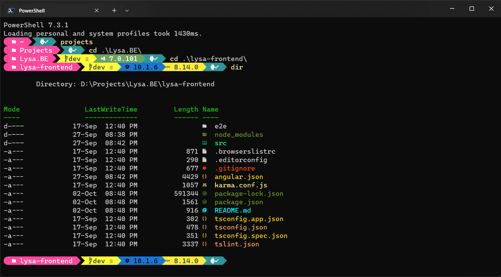

# Terminal Customization

Terminal is configured with the oh-my-posh theme for the use.

Once the terminal is configured, it looks like this

## Additional Packages used

- z
  - For display of the History
- Terminal-Icons
  - For display of glyphs against the files

## Note

Install the Terminal application and set the Powershell as the default profile.\
_Windows 11 has Terminal built-in_

Run the ps1 file only in the terminal after setting the Powershell as the default profile.

### References:

[My Ultimate PowerShell prompt with Oh My Posh and the Windows Terminal - Scott Hanselman's Blog](https://www.hanselman.com/blog/my-ultimate-powershell-prompt-with-oh-my-posh-and-the-windows-terminal)
